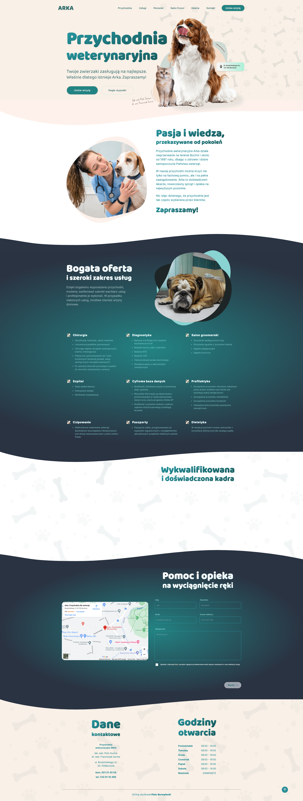
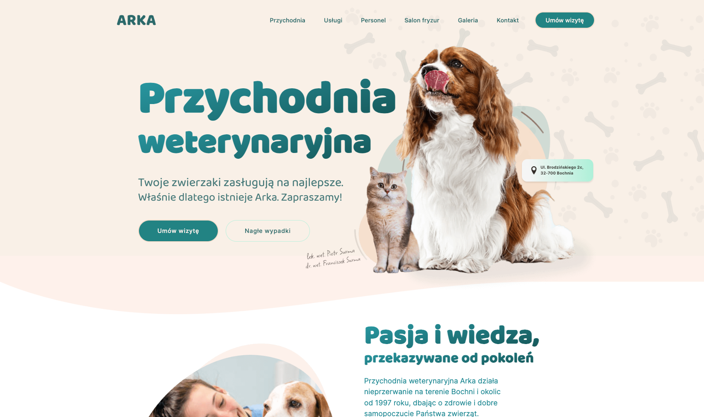
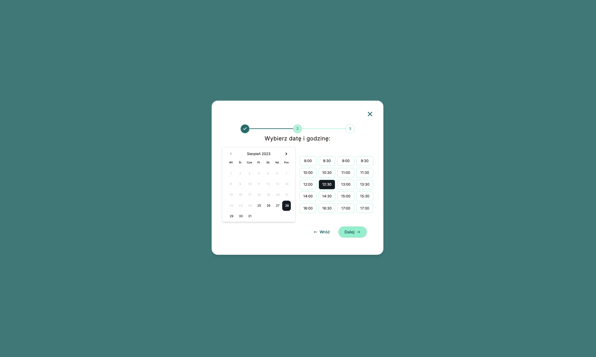
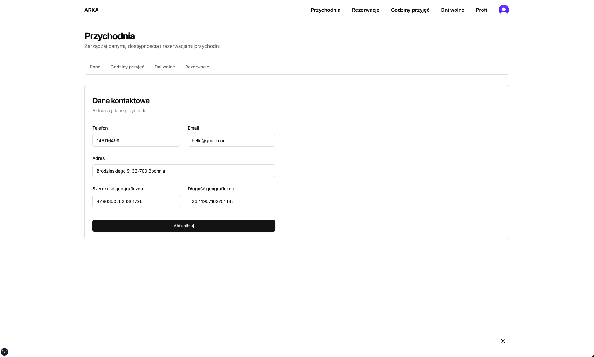
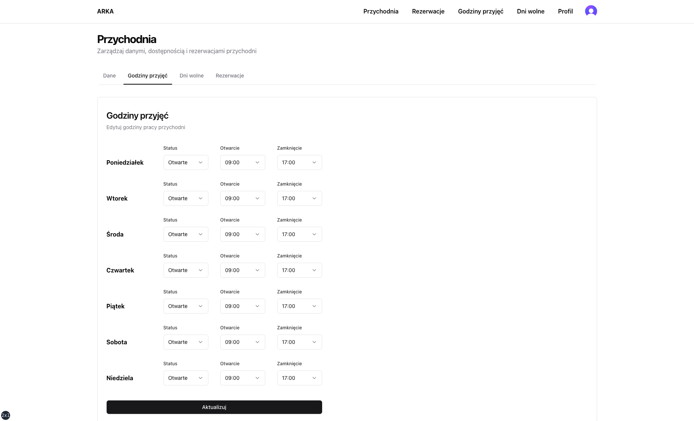
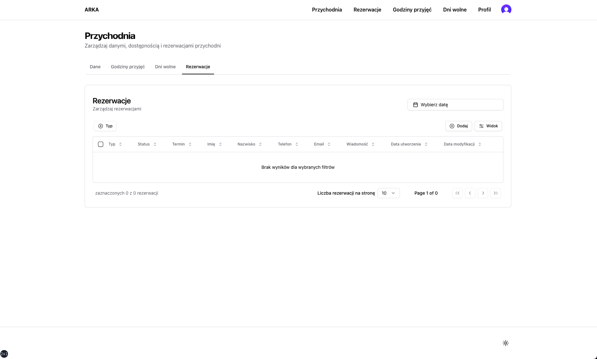

# Brian Oduor Physiotherapy - Appointment Booking and Management System

## Description

This project is a physiotherapy clinic website with appointment booking functionality. Built with modern technologies for optimal performance and user experience.

The website provides:
- Physiotherapy, hydrotherapy, and home-based treatment booking
- Admin dashboard for managing appointments
- Email notifications for bookings
- Business hours configuration

**Tech Stack:**
- **Framework:** Next.js 14
- **Authentication:** Next-Auth v5
- **Database:** PostgreSQL (Neon)
- **ORM:** Drizzle ORM
- **Forms:** React Hook Form
- **Email:** React Email and Resend
- **Validations:** Zod
- **Styling:** Tailwind CSS
- **UI Components:** shadcn/ui
- **Hosting:** Vercel

**Features:**
- [x] Email and Password authentication
- [x] Email verification
- [x] Database and ORM setup
- [ ] Password reset functionality
- [x] Functional booking form
- [x] Admin dashboard
- [x] Input validation
- [ ] Transactional emails

 

## Usage instructions:

To safeguard against the creation of test bookings in the live environment, which may interfere with my client's actual appointments, I have implemented a dedicated demo environment for you to explore the functionality of this website and accompanying booking system. To access the demo, go [TODO: UPDATE THIS LINK](https://localhost:3000) to use the following credentials:

- **Email**: `arka@pjborowiecki.com`
- **Password**: `ArkaDemo1!`

Feel free to navigate the platform, and test various features, including booking management. Please note that any actions performed in this demo environment are for testing purposes only and will not impact the actual database or real bookings.

**As access is provided to the wider internet, I would like to emphasize that I do not assume responsibility for any content or actions initiated by other users during testing. This includes, but is not limited to, bookings with inappropriate messages or any other unintended use of the platform. I appreciate your understanding and encourage responsible exploration of this demo environment. If you have any concerns or questions, please feel free to contact me.**

 

 

## Tech Stack

- **Framework:** [Next.js 14](https://nextjs.org)
- **Authentication:** [Next-Auth](https://next-auth.js.org/)
- **Database:** [PostgreSQL (Neon)](https://neon.tech/)
- **ORM:** [Drizzle ORM](https://orm.drizzle.team)
- **Forms:** [React Hook Form](https://react-hook-form.com)
- **Email:** [React Email](https://react.email) and [Resend](https://resend.com)
- **Validations:** [Zod](https://zod.dev/)
- **Styling:** [Tailwind CSS](https://tailwindcss.com)
- **UI Components:** [shadcn/ui](https://ui.shadcn.com)
- **Hosting:** [Vercel](https://vercel.com)

 

## Features:

- [x] Email and Password authentication with NextAuth v.5 and its middlewaree
- [x] Email address verification functionality
- [x] Database and ORM set up with Neon's PostgreSQLL and DrizzleORM
- [x] Password reset functionality
- [ ] Email templates with React Email
- [x] Functional contact form
- [x] Functional and styled landing page
- [x] Admin dashboard UI
- [x] Input validation with Zod
- [x] Rigorous linting and TypeScript type checking

 

- [ ] Implement mobile navigation (ladning and admin)
- [x] Functional booking form
- [ ] Refactor availability-, booking-, clinic-, user-, and email-related server actions, to be consistent with auth actions.
- [ ] Complete the privacy policy page
- [ ] Translate email templates to Polish
- [ ] Fetch bookings in the admin panel
- [ ] Server-side pagination of results in admin dashboard
- [ ] CRUD operations for bookings in the admin dashboard (confirm, update, reject, delete)
- [ ] Booking re-scheduling functionality
- [ ] Transactional emails for customers and admin
- [ ] Style the booking page
- [ ] User profile and settings pages
- [ ] Smooth scroll to sections
- [ ] Scroll back up button
- [ ] Custom loading pages with skeleton loaders
- [ ] Custom error pages
- [ ] Improve performance and make Edge compatible
- [ ] Add tests
